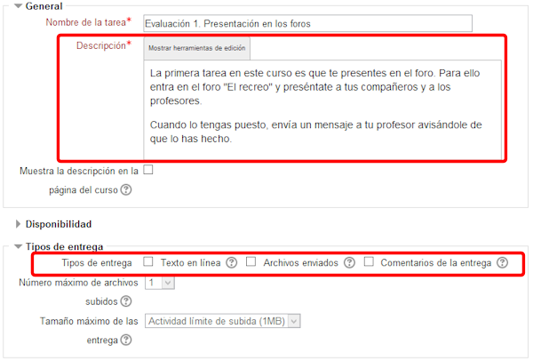

# Actividad no en línea

En este tipo de tarea el profesor/a propone a los estudiantes algún tipo de trabajo o actividad que no deben realizar directamente en el aula virtual. Puede ser una actividad que utilice las TIC, como por ejemplo acceder a información en la red para realizar un ejercicio, realizar un trabajo, crear un blog, participar en un foro o chat no calificable directamente, ... pero también puede ser una actividad ajena a la utilización de las TIC, como por ejemplo proponer la lectura de un libro, el visionado de un vídeo, la lectura de un artículo, etc.

El profesor/a accederá al trabajo del estudiante fuera de la plataforma pero posteriormente podrá calificarlo dentro de la misma, ya que la tarea aparecerá en el calificador si así la hemos configurado.

 

Para crear una tarea de este tipo tenemos que, como ya se ha dicho, **activar edición** y pulsar en el botón añadir una actividad o un recurso. Aparecerá la ventana con la lista de actividades y recursos que podemos añadir. Elegimos **Tarea**. Con esto aparecerá en pantalla un formulario con las opciones necesarias para configurar la tarea:

**Fig. 5.5 Captura de pantalla. Opciones para tarea.**

 

Tras el título, que aparecerá en la portada del curso y en la portada del módulo, tendremos que poner el enunciado de la tarea que los alumnos deben realizar. Para ello hay un editor HTML, como el que hemos conocido anteriormente. 

Este enunciado, si no se marca la casilla **Muestra la descripción en la página del curso**, sólo se verá cuando el alumno entre a la tarea para saber en qué consiste.

La otra cuestión importante es que, en la sección de "**Tipos de entrega**", no marquemos ninguna de las opciones que propone.

El alumno verá este tipo de tarea de la siguiente forma:

**Fig. 5.6 Captura de pantalla. Vista de tarea.**

 

Hay otras opciones que debemos configurar pero las explicaremos más adelante. Por ahora tú puedes ir mirando esas otras opciones y, en la práctica deducir para qué sirven.

## Tarea1

Crea una tarea No en línea.

Recuerda que este tipo de tarea no se realiza dentro de la propia plataforma. Puede ser, por ejemplo, la referencia a la nota de un examen o trabajo.
