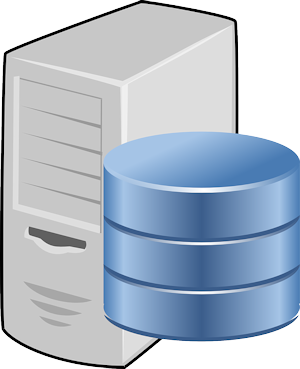

# Bases de datos sencillas

**Obtenida de [Pixabay](http://pixabay.com/en/computer-database-network-server-156948/). Licencia CC0**

Esta actividad permite que los usuarios incorporen datos en un formulario diseñado por el profesor/a del curso. Las entradas se pueden clasificar, buscar,... y pueden contener el texto, imágenes y otros formatos de información.

Tiene diferentes tipos de campos:

- **Texto**
- **Imágenes**
- **Archivo**
- **URL**
- **Fecha**
- **Menú**
- **Menú (Selección múltiple)**
- **Botón de marcar (Checkbox)**
- **Botones de elección (Radio buttons)**

### Las características más importantes de una base de datos son

- Permite que **sólo se puedan ver los registros** de la base de datos, **cuando el usuario haya introducido un determinado número** de registros en ella.
- Permite **configurar los derechos de edición**. Puede agregar entradas profesores/as y alumnos/as, si lo permite en la base de datos. Esto no restringe la visualización de sus entradas para todos.
- Se puede limitar el **número máximo de entradas de cada participante**.
- Podemos permitir **añadir comentarios a las entradas** de la base de datos.
- Podemos habilitar la **revisión del profesor/a** antes de que las entradas sean públicas.
