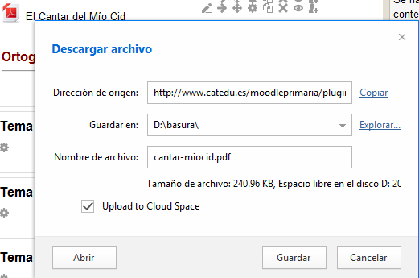

# Como catálogo de recursos

### Catálogo

También podría hablarse de expositor o repositorio. Nos referimos a la necesidad que a veces tiene un profesor de facilitar material a sus alumnos o quizá a otros profesores. Es cierto que también tenemos otras posibilidades para hacerlo, como enviar un archivo adjunto por correo electrónico, subirlo a una página web o repartir fotocopias, pero Moodle añade el valor de establecer una comunciación, de que podamos relacionarnos con los distintos usuarios que accedan a la plataforma, pedirles su opinión y darles la nuestra e incluso permitirles que sean ellos mismos los que añadan recursos.

Este catálogo pretende ser un instrumento de apoyo a las clases.

Existen muchas otras formas de tener un repositorio de materiales más operativas, fáciles y sencillas que moodle, como Google Drive, pero es un uso frecuente.

Vamos a tomar la estructura que hemos seguido para aprender a subir recursos a nuestro espacio educativo. Añadiremos algunos otros y las etiquetas necesarias.

Si pensamos en un profesor de **Lengua y Literatura**, que da clases de** Lengua Española** en 3º ESO y la optativa de **Procesos de Comunicación** en 4º ESO, podríamos habilitar un tema para cada nivel y albergar allí los recursos que queremos mostrar a nuestros alumnos.

## Materiales 3º ESO

Vamos a crear dos etiquetas dentro del mismo tema:
 
### 1. Lecturas.

### 2. Ortografía.
 
Tras la etiqueta de Lecturas vamos a añadir una página con indicaciones generales para la lectura.

1. Para las** lecturas** hemos buscado en Google documentos en PDF de obras clásicas que están incluidas en la programación de 3º ESO:

Guardamos el archivo en nuestro ordenador y lo subimos al sistema de archivos de Moodle.

Enlazamos el documento, utilizando la página de edición para el recurso **Enlazar un archivo**:

Como queremos dar la posibilidad de que se descarguen un documento de nuestra página de Moodle, conviene que activemos **Forzar descarga**; así, al seleccionar el documento, se tendrá la doble opción de** Abrir** o **Guardar archivo:**

 
2. Para el apartado de **Ortografía **tenemos subido el archivo en PDF de la **Ortografía de la Lengua Española**, editada por la Real Academia Española, por el recurso de **Archivo** y también la web de Ortografía de la RAE.

Hemos elaborado una **página** con un ejercicio sobre ortografía y el aviso de cuándo y dónde se debe entregar hecho:

El catálogo de materiales para 3º de ESO quedaría así:

 

 
