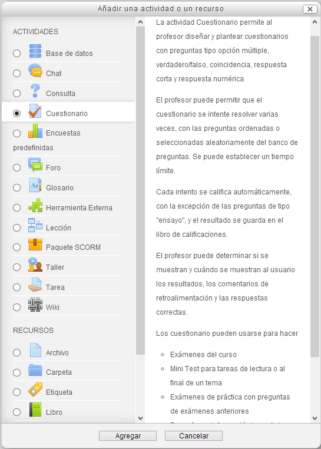
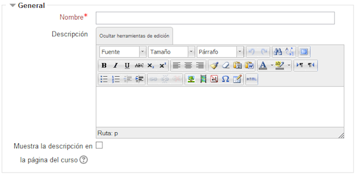
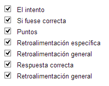
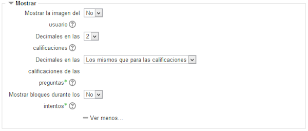
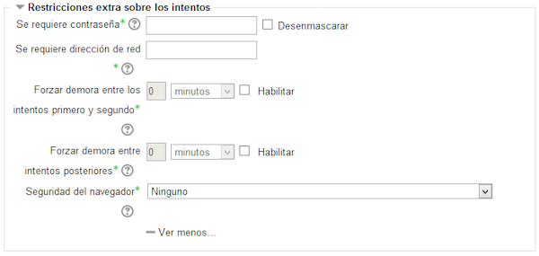
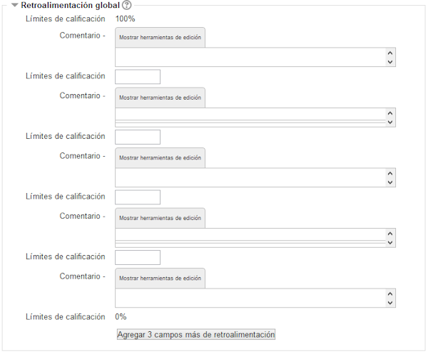

# Configuración de un cuestionario

Vamos a agregar y configurar un cuestionario en Moodle. Para ello, activamos la **edición **y, en el bloque que nos interese pulsamos el botón **Agregar una actividad o un recurso**, seleccionamos **Cuestionario**

**Fig. 5.29 Captura de pantalla. Ventana de inserción de formulario.**

 

Se abre un cuadro de diálogo que hemos de rellenar los siguientes grupos de opciones:

1. **General**
1. **Temporalización**
1. **Calificación**
1. **Esquema**
1. **Comportamiento de las preguntas**
1. **Revisar opciones**
1. **Mostrar**
1. **Restricciones extra sobre los intentos**
1. **Retroalimentación global**
1. **Ajustes comunes del módulo**

 

### 1. **General**

 

**Fig. 5.30 Captura de pantalla. General**

  Rellenamos el **nombre **y una pequeña **descripción **de lo que se pretende (se puede dejar en blanco, aunque es recomendable proporcionar información al estudiante sobre lo que debe hacer en el cuestionario).

 

### **2. Temporalización**

**Fig. 5.31 Captura de pantalla. Temporalización**

 

- **Fechas**: De apertura y cierre. Se pueden **deshabilitar**.

- **Límite de tiempo:** Es el tiempo que se da a los alumnos para realizar el cuestionario. El tiempo empieza a contar desde la entrada del alumno en el cuestionario.   
- **Cuando el tiempo ha terminado**: Con este parámetro controlamos qué sucede si el alumno no envía su intento de resolver el cuestionario antes de que el tiempo expire.  
- **Periodo de gracia para en envío:** Si se ha establecido que cuando termina el tiempo para realizar el cuestionario "Se permite un periodo de gracia para hacer el envío, pero sin poder cambiar las respuestas".

 

### 3.  Calificación

**Fig. 5.32 Captura de pantalla. Calificación.**

 

- **Categoría de la calificación**: Este parámetro controla la categoría en la que las calificaciones de esta actividad están ubicadas en el libro de calificaciones  
- I**ntentos permitidos**: Número de intentos que se permiten hasta superar el cuestionario.  
- **Método de calificación:  **Cuando se permiten múltiples intentos, hay diferentes maneras en las que puede usar las distintas calificaciones obtenidas para calcular la puntuación final del examen.

<li style="list-style-type: none;">
<ul>
- **Calificación más alta:** La puntuación final es la más alta en cualquiera de los intentos.

<li style="list-style-type: none;">
<ul>
- **Puntuación media:** La puntuación final es el promedio (la media) de la puntuación de todos los intentos.

<li style="list-style-type: none;">
<ul>
- **Primera calificación:** La puntuación final es la obtenida en el primer intento (se ignoran los demás intentos).

<li style="list-style-type: none;">
<ul>
- **Última calificación:** La calificación final es la obtenida en el intento más reciente.

 

### **4. Esquema**

**Fig. 5.33 Captura de pantalla. Esquema**

 

Esta sección especifica cómo se van a presentar las preguntas del cuestionario:

- **Orden de las preguntas**: Podemos elegir entre presentar las preguntas en el orden en que aparecen en la pantalla de edición o que las ordene aleatoriamente  
- **Página nueva**: Cuendo el cuestionario tiene varias preguntas podemos necesitar que se presenten en varias páginas. Podemos elegir cada cuántas preguntas cambiará de página  
- **Método de navegación**: Especificaremos si en el cuestionario se podrá pasar a cualquier página o ha de responderse secuencialmente.

 

### 5. Comportamiento de las preguntas

**Fig. 5.34 Captura de pantalla. Compportamiento de las preguntas.**

 

- **Ordenar al azar dentro de las preguntas**: Seleccionándolo, las opciones (en aquellas preguntas en que las haya) se ordenarán aleatoriamente. Cada vez que el alumno entre a resolver las podrá encontrar en un orden.  
- **Comportamiento de las preguntas**: Especifica cómo y cuándo se ha de recibir la retroalimentación automática.  
- **Cada intento se basa en el anterior**: Si se permiten varios intentos y se selecciona Sí, cada nuevo intento contendrá el resultado del anterior. Esto permite completar un cuestionario haciendo varios intentos partiendo en cada uno del resultado anterior.

 

 

### 6. Revisar opciones

Estas opciones controlan qué información pueden ver los estudiantes cuando revisan un intento de resolver el cuestionario o cuando consultan los informes del cuestionario.

- **Durante el intento**: los ajustes solo son relevantes en algunas situaciones, como en el caso "interactivo con varios intentos", que pueden mostrar información durante el intento.  
- **Inmediatamente después del intento**: los ajustes se aplican los dos primeros minutos después de que se haya pulsado "Enviar todo y terminar"  
- **Posteriormente, cuando el intento aún está abierto**: los ajustes se aplican después de esto, y antes de la fecha de cierre del cuestionario  
- **Después de que el intento esté cerrado**: los ajustes se aplican después de que a fecha de cierre del cuestionario haya pasado. Si la prueba no tiene una fecha de cierre, este estado no se alcanza nunca.

Para cada uno de estos momentos presenta las mismas opciones que hay que activar si se desea que se vean:

**Fig. 5.35 Captura de pantalla. Revisar opciones**

 

### 7. Mostrar

**Fig. 5.36 Captura de pantalla. Mostrar.**

 

- **Mostrar la imagen del usuario. **Un ejemplo en el que interesaría hacer esto es en cuestionarios **proctorados** (vigilados en el aula) para hacer más sencillo el verificar la identidad del usuario que intenta el cuestionario.**  **
- **Decimales en las calificaciones**: Especifica el número de decimales que tendrá la calificación de cada uno de los intentos.  
- **Decimales en las calificaciones de las preguntas. **Especifica el número de decimales que tendrá la calificación de cada una de las preguntas.**  **
- **Mostrar bloques durante los intentos: **Si se seleccionamos SÍ, se mostrarán los bloques normales durante los intentos de resolver el cuestionario

###  

###  8. Restricciones extra sobre los intentos

**Fig. 5.37 Captura de pantalla. Restricciones extra sobre los intentos**

 

- **Se requiere contraseña**: Si se especifica, los alumnos tendrán que introducirla para poder realizar cada intento  
- **Se requiere dirección de red**: Se puede restringir el acceso a un cuestionario a una subred particular en una LAN o en Internet especificando una lista separada por comas de los números parciales o completos del dirección IP. Puede ser útil para casos de cuestionarios sin vigilancia, para asegurar que solo las personas en ciertas ubicaciones pueden acceder al cuestionario  
- **Forzar demora entre los intentos primero y segundo**: Se puede especificar el tiempo que tendrá que esperar el alumno para poder contestar por segunda vez el cuestionario.  
- **Forzar demora entre intentos posteriores**: Igualmente puede especificarse un tiempo que deberá esperar el alumno para sucesivos intentos de resolver el cuestionario  
- **Seguridad del navegador**: Si está seleccionada la "Pantalla completa emergente con cierta seguridad JavaScript",  
<ul>
- El cuestionario sólo se iniciará si el estudiante tiene un navegador con JavaScript activado  
- El cuestionario aparece en una ventana emergente a pantalla completa que cubre todas las otras ventanas y no tiene controles de navegación  
- Se impide a los estudiantes, en la medida de lo posible, el uso de acciones como copiar y pegar

 

###  9. Retroalimentación global

**Fig. 5.38 Captura de pantalla. Retroalimentación global**

 

La retroalimentación global consiste en un texto que se muestra al estudiante una vez que ha completado un intento de resolver el cuestionario. El texto puede depender de la calificación que el estudiante haya obtenido.

Los límites de las calificaciones pueden especificarse en forma de porcentajes, por ejemplo "31.41%", o en forma de números, por ejemplo "7". Si el cuestionario tiene 10 notas, un límite de calificación de 7 significa 7/10 o superior.

###  10. Ajustes comunes del módulo

Este apartado ya lo hemos visto al hablar de las tareas. 

 

 

Para terminar debes pulsar sobre el botón **Guardar cambios y regresar al curso**, que te llevará a la página principal del curso, o en el botón **Guardar cambios y mostrar**, lo que te llevará a ver el cuestionario que hemos creado o modificado. También puedes optar por **Cancelar**, con lo que perderás todos los cambios hechos.

## Tarea1

Configura un cuestionario en Moodle. Hazlo comprobando bien las características que le aplicas.

Este cuestionario lo utilzaremos luego para ponerle las preguntas. De momento lo dejamos definico.
