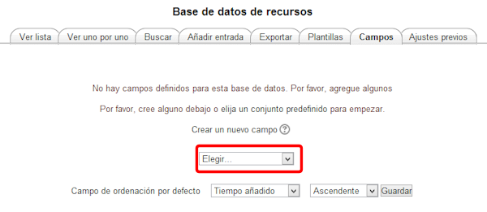
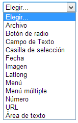
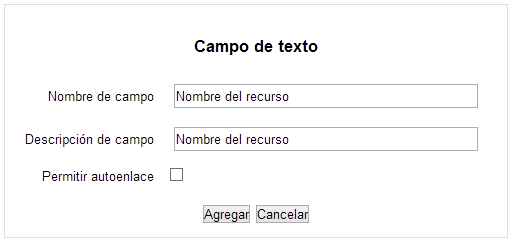
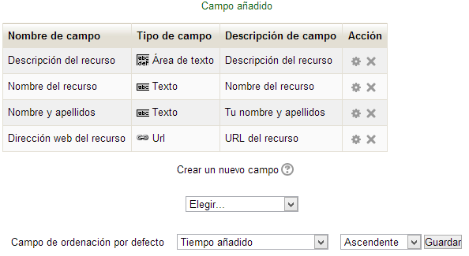

# Crear campos

Haciendo clic en **Guardar cambios y mostrar **aparece la siguiente pantalla:

**Fig. 5.94 Captura de pantalla. Creación de campos.**

 

Vamos a crear campos para esta base de datos.

- **Crear un nuevo campo:** En esta pantalla puede crear los campos que formarán parte de su base de datos. Cada campo admite distintos tipos de datos, con diferentes interfaces. Se puede elegir entre:

**Fig. 5.95 Captura de pantalla. Tipos de campos.**

 

### Tipos de campos

- **Archivo**: Permite que los **usuarios suban un fichero** desde su ordenador. Si se trata de un **fichero de imagen** sería mejor opción seleccionar el **campo dibujo**.

- **Botones de radio: **Permite al usuario **escoger una de diversas opciones**. Además, tan sólo podrá guardar la entrada cuando haya realizado la selección. Si sólo hay dos opciones opuestas (por ejemplo verdadero/falso, sí/no), se puede utilizar una caja de selección múltiple, aunque de esta manera se podrán guardar entradas aunque el usuario no haya seleccionado ninguna de las opciones.

- **Campo de texto**: Los usuarios pueden escribir hasta** 60 caracteres de texto**. El **campo área de texto** se puede utilizar para **textos más largos** o que requieran algún tipo de formato.  
- **Caja de selección:** Permite crear una o más cajas de selección. Cada línea escrita en las "opciones" aparecerá como una caja de selección diferente en la ventana de edición de la entrada. Al editar la entrada podremos seleccionar una o más de las opciones y al visualizar la entrada aparecerá en el campo correspondiente el texto de la o las opción/es seleccionada/s (en el caso de que se haya seleccionado más de una opción aparecerán la una bajo la otra, no en la misma línea). Los Botones de radio se pueden utilizar si se desea que el usuario, al editar la entrada, seleccione tan sólo una de las opciones.

- **Fecha**: Permite que los usuarios entren una fecha seleccionando en un listado desplegable el día, mes y año correspondientes.  
- **Imagen**: Permite al usuario subir un **fichero de imagen** desde su ordenador.  
- **Latlong** (Latitud/Longitud): En este campo los usuarios pueden introducir una localización geográfica especificando su latitud y longitud. Al mostrarse el registro, mostrará un link generado automáticamente por los servicios de localización geográfica como Google Earth, Google Maps, OpenStreetMap, GeaBios,Mapstars, etc. El profesor puede elegir cuál de estos servicios geográficos utilizará.

- **Menú**: Es parecido a la caja de selección pero el texto escrito en el área opciones se presentará como un **listado desplegable** a la hora de editar la entrada. Cada línea de las opciones será una opción del desplegable.

- ** Menú múltiple:** Parecido al caso anterior pero permite que el usuario **seleccione más de una opción** al editar la entrada manteniendo apretadas las teclas de control o mayúsculas mientras clica con el ratón. Resulta un poco más complejo de utilizar que la caja de selección, que también permite selecciones múltiples.

- **Número**: Pide a los usuarios que escriban un número. El número debe ser entero, aunque puede ser negativo (por ejemplo: -2,-1,0,1,2,3,...). Si se escriben caracteres no numéricos éstos y los que le siguen no aparecerán o, si no hay ningún número, el resultado será el cero. Por ejemplo: "3.14" se transformará en "3"; "1,000,000" en "1"; y "seis" aparecerá como "0".

- **URL**: Pide al usuario que escriba una URL. Si se selecciona la opción "autoenlazar la URL", ésta aparecerá como un hipervínculo. Si además se escribe algo en nombre forzado para el enlace éste será el texto utilizado para el hipervínculo. Por ejemplo: en una base de datos sobre autores puede resultar interesante incorporar la página web del autor. Si se escribe "página web" como nombre forzado, al hacer clic en el texto **página web** de la entrada podremos acceder a la URL que hayamos escrito.

- **Área de texto:** Permite a los usuarios escribir un texto largo y añadirle formato de manera similar a cuando se escribe un mensaje a un foro. Puede especificar el ancho en columnas y el alto en filas del área que se presentará a los usuarios.

De acuerdo con la pregunta formulada tendremos que poner a disposición de los alumnos/as los campos siguientes para que rellenen:

<ul>
- **Tu nombre y apellidos.**
- **Nombre del recurso aportado.**
- **Dirección web del recurso.**
- **Descripción: utilidad del recurso.**

Vamos a crear el campo **Nombre y apellidos** como campo de texto. Seleccionamos **texto **y aparece la pantalla:

**Fig. 5.96 Captura de pantalla. Creación de campo de texto.**

 

Todos los campos necesitan un nombre y una descripción cuando se crean.

Pinchando en **Agregar **aparece el nuevo campo creado y podemos seguir añadiendo campos.

**Fig. 5.97 Captura de pantalla. Campos.**

 

Desde esta ventana podemos volver a **editar **cualquiera de los campos o **eliminarlos**.

La base de datos ya está disponible para añadir entradas.

## Tarea1

Configura una base de datos para tu curso que contenga al menos tres campos a rellenar por tus alumnos/as.
