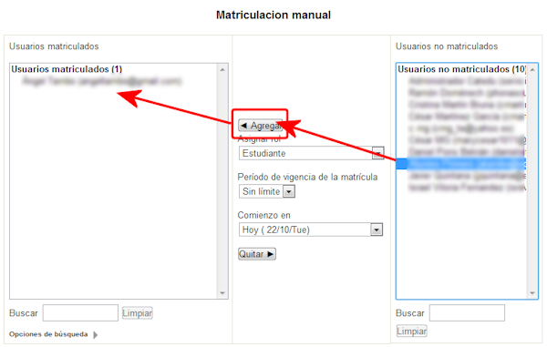
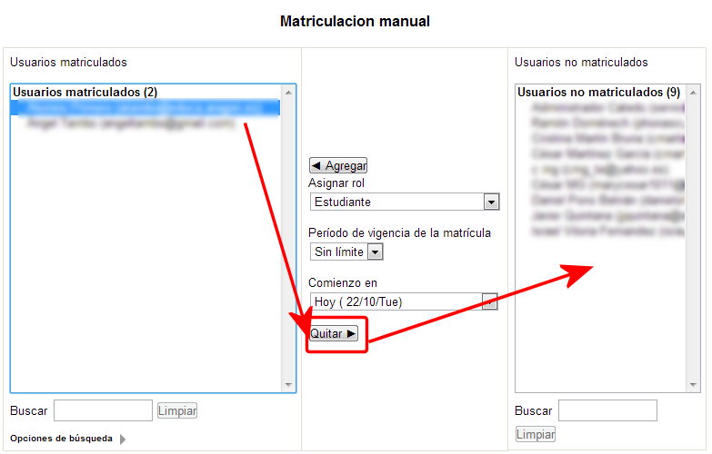
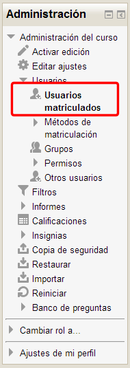

# Matriculación y Roles

Cuando los alumnos/as ya están registrados en la plataforma (y tienen por tanto adjudicado un usuario y una contraseña), es relativamente sencillo permitirles el acceso a nuestro curso si no queremos permitir que se matriculen ellos mismos, como proponemos en la **Opción A**.

En el bloque de Administración, despliega la opción **Usuarios **y allí elige la opción **Métodos de matriculación**.

Si no tienes el bloque de administración, puedes acceder a los "Métodos de matriculación" pulsando "Configuración > Más > Usuarios

En la pantalla que se nos mostrará podremos añadir los usuarios que nos interesen de forma sencilla:

**Fig. 4.9 Captura de pantalla. Matriculación manual**

 

En el cuadro de la izquierda muestra los usuarios matriculados actualmente en el curso y en el de la derecha la lista completa de usuarios de nuestro Moodle. Sólo es cuestión de ir seleccionando a los usuarios de la izquierda (manteniendo pulsada la tecla CTRL mientras lo hacemos podemos seleccionar a varios). Una vez seleccionados pulsamos en el botón **Agregar**. 

Antes de hacer nada comprueba las siguientes cuestiones:

1. Qué el rol a asignar es ****estudiante****.
1. El periodo de vigencia de la matrícula, que oscila entre ****sin límites y 365 días****. Lo normal es que dejes la opción ****sin límites****.
1. ****Fecha en que comienza la matrícula****. Por defecto aparece el día actual, pero puedes establecer una fecha diferente si, por ejemplo, te interesa que los estudiantes no puedan acceder al curso hasta una fecha concreta, mientras preparas los materiales, actividades, …

 

Cada vez que selecciones a uno o varios estudiantes, puedes pulsar en ****agregar**** para pasarlos al listado de la izquierda (que aparece vacío).

Si te equivocas con algún alumno/a, puedes seleccionarlo y pulsar **Quitar**.

**Fig. 4.10. Captura de pantalla. Quitar matriculado**

 

Si hemos sido cuidadosos, al introducir a los usuarios en nuestro curso les habremos asignado el rol adecuado. No obstante siempre podemos cambiar esto desde la opción **Usuarios** &gt; **Usuarios matriculados** del panel de administración:

**Fig. 4.11 Captura de pantalla. Bloque Administración**

 

Esto nos lleva a la relación de usuarios que hay matriculados en nuestro curso con la opción de cambiarles el rol:

 

**Fig. 4.12 Captura de pantalla. Asignar roles**

 

Desde aquí podemos también quitar a un usuario del curso o cambiar las condiciones de su matrícula.

 

También puedes ver un resumen rápido de los contenidos en el siguiente vídeo tutorial.

[**Vídeo tutorial Asignar rol estudiante**](videotutorial_matriculacion.swf)

 

## Actividad de Espacios en Blanco

<li>Qué el rol a asignar es  
<label class="sr-av" for="clozeBlank117_22.0">Rellenar huecos (1):</label>
<input class="autocomplete-off" id="clozeBlank117_22.0" style="width:10em" type="text" value=""/>
JXUwMDNkJXUwMDE2JXUwMDA3JXUwMDAxJXUwMDExJXUwMDBkJXUwMDA4JXUwMDBmJXUwMDFhJXUw
MDEx

 .</li>
<li>El periodo de vigencia de la matrícula, que oscila entre  
<label class="sr-av" for="clozeBlank117_22.1">Rellenar huecos (2):</label>
<input class="autocomplete-off" id="clozeBlank117_22.1" style="width:3em" type="text" value=""/>
JXUwMDJiJXUwMDFhJXUwMDA3

<label class="sr-av" for="clozeBlank117_22.2">Rellenar huecos (3):</label>
<input class="autocomplete-off" id="clozeBlank117_22.2" style="width:7em" type="text" value=""/>
JXUwMDM0JXUwMDgxJXUwMDgwJXUwMDA0JXUwMDFkJXUwMDExJXUwMDE2

   y   
<label class="sr-av" for="clozeBlank117_22.3">Rellenar huecos (4):</label>
<input class="autocomplete-off" id="clozeBlank117_22.3" style="width:3em" type="text" value=""/>
JXUwMDZiJXUwMDA1JXUwMDAz

   días . Lo normal es que dejes la opción  
<label class="sr-av" for="clozeBlank117_22.4">Rellenar huecos (5):</label>
<input class="autocomplete-off" id="clozeBlank117_22.4" style="width:3em" type="text" value=""/>
JXUwMDJiJXUwMDFhJXUwMDA3

<label class="sr-av" for="clozeBlank117_22.5">Rellenar huecos (6):</label>
<input class="autocomplete-off" id="clozeBlank117_22.5" style="width:7em" type="text" value=""/>
JXUwMDM0JXUwMDgxJXUwMDgwJXUwMDA0JXUwMDFkJXUwMDExJXUwMDE2

 .</li>
<li>
<label class="sr-av" for="clozeBlank117_22.6">Rellenar huecos (7):</label>
<input class="autocomplete-off" id="clozeBlank117_22.6" style="width:5em" type="text" value=""/>
JXUwMDFlJXUwMDIzJXUwMDA2JXUwMDBiJXUwMDA5

   en   que   comienza   la   
<label class="sr-av" for="clozeBlank117_22.7">Rellenar huecos (8):</label>
<input class="autocomplete-off" id="clozeBlank117_22.7" style="width:9em" type="text" value=""/>
JXUwMDM1JXUwMDBjJXUwMDE1JXUwMDA2JXUwMDlmJXUwMDhlJXUwMDE2JXUwMDE5JXUwMDBk

 .
	Por defecto aparece el día en que estás asignando a los alumnos/as,
	pero puedes establecer una 
<label class="sr-av" for="clozeBlank117_22.8">Rellenar huecos (9):</label>
<input class="autocomplete-off" id="clozeBlank117_22.8" style="width:5em" type="text" value=""/>
JXUwMDNlJXUwMDAzJXUwMDA2JXUwMDBiJXUwMDA5

 diferente si, por ejemplo, te interesa
	que los 
<label class="sr-av" for="clozeBlank117_22.9">Rellenar huecos (10):</label>
<input class="autocomplete-off" id="clozeBlank117_22.9" style="width:11em" type="text" value=""/>
JXUwMDNkJXUwMDE2JXUwMDA3JXUwMDAxJXUwMDExJXUwMDBkJXUwMDA4JXUwMDBmJXUwMDFhJXUw
MDExJXUwMDE2

 no puedan acceder al curso hasta una fecha
	concreta, mientras preparas los materiales, actividades, …</li>

<input class="button" id="submit117_22" name="submit117_22" type="submit" value="Enviar"/>
<input id="restart117_22" name="restart117_22" onclick="$exe.cloze.restart('117_22')" style="display:none" type="button" value="Reiniciar"/>
<input id="showAnswersButton117_22" name="117_22showAnswersButton" onclick="$exe.cloze.fillInputs('117_22')" style="display:none" type="button" value="Mostrar las respuestas"/>
Habilitar JavaScript

## Actividad 2

**Matricula a un mínimo de 15 y un máximo de 30 estudiantes en tu curso**, siguiendo las instrucciones de asignación de roles. 
