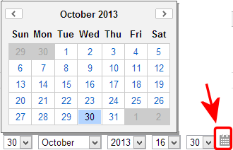
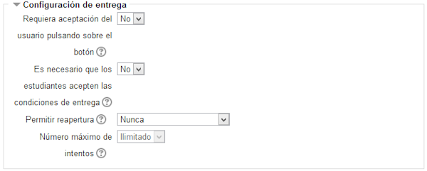

# Otras opciones para las tareas

Además de los dos grupos de opciones que hemos visto en los capítulos anteriores, el **General** y el **Tipos de entrega**, cuando introducimos una tarea tenemos otras opciones disponibles. Vamos a verlas grupo a grupo:

 

### Disponibilidad

**Fig. 5.14 Captura de pantalla. Disponibilidad**

 

En estas opciones marcaremos el tiempo en que la tarea estará visible y si siempre se mostrará la descripción. Las opciones a configurar son:

- **Permitir entregas desde**: Es la fecha en que estará disponible la actividad para entregar lo que se está pidiendo, sea uno o varios archivos o sea un texto en línea. Para que haya una fecha a partir de la cual se puedan entregar los trabajos, hay que seleccionar la casilla Habilitar y poner la fecha en que inicia el plazo. Si no se habilita, los estudiantes podrán entregar sus trabajos de inmediato.  
- **Fecha de entrega**: Después de la fecha que se marque aquí se permitirán los envíos, pero los trabajos se marcarán como atrasados. Si no se quieren admitir trabajos fuera de un plazo habría que inhabilitar esta opción o poner como fecha de entrega la misma que la fecha límite.  
- **Fecha límite**: Con esta opción marcamos la fecha a partir de la cual ya no se pueden presentar los trabajos. Por supuesto, para ello hay que habilitarla.  
- **Mostrar siempre la descripción**: Si se marca esta opción, la Descripción de la Tarea solo será visible para los estudiantes en la fecha "Permitir entregas desde",

En el caso en que haya que elegir fecha, podemos hacerlo eligiendo el valor en los desplegables correspondientes (día - mes - año - hora - minuto) o podemos pulsar sobre el icono del calendario para seleccionar la fecha sobre un calendario emergente. Es más cómodo, pero hay que estar atento a todos los valores de día, mes y año antes de aceptar un valor. La hora no pondemos elegirla en el calendario y habría que hacerlo sobre los desplegables correspondientes a horas y minutos.

**Fig. 5.16 Captura de pantalla. Cambiar fecha.**

 

### Tipos de retroalimentación

**Fig 5.17 Captura de pantalla. Tipos de retroalimentación.**

 

Las opciones son las siguientes:

- **Comentarios de retroalimentación**: Estando esta opción habilitada, el profesor puede dejar comentarios para cada entrega de los alumnos  
- **Hoja de calificaciones externa**: Estando esta opción habilitada, el profesor podrá cargar y descargar una hoja de cálculo con las calificaciones de los estudiantes cuando puntúe las tareas.  
- **Archivos de retroalimentación**: Si se habilita esta opción, el profesor podrá enviar la retroalimentación por medio de un archivo de texto o de sonido.

 

### Configuración de entrega

**Fig. 5.18 Captura de pantalla. Configuración de entrega**

 

- **Requiera aceptación del usuario pulsando sobre el botón**: Si se elige Sí, a los alumnos les aparecerá un botón de Entrega. Una vez que lo pulsen, la entrega se considerará definitiva. Con esto se permite que los alumnos vayan teniendo borradores del trabajo que han de modificar más adelante.   
- **Es necesario que los estudiantes acepten las condiciones de entrega**: Si se selecciona que Sí, los alumnos tendrán que verificar que la entrega que realizan es totalmente suya, exceptuando aquella bibliografía a la que hagan referencia dentro del mismo.  
<li>**Permitir reapertura**: Se puede elegir en qué condiciones puede reabrirse la tarea para que los estudiantes la completen. Las opciones disponibles son:  
<ul>
- Nunca - No se permite el reenvío
- Manual - El profesor puede permitir manualmente el reenvío
- Automática hasta aprobar - el envío del estudiante se vuelve a abrir automáticamente hasta que alcance la calificación para aprobar.

 

### Configuración de entrega por equipos

**Fig. 5.19 Captura de pantalla. Configuración de entrega por equipos.**

 

- **Entrega por equipos**: Si está habilitado los alumnos se dividirán en grupos para la entrega de la tarea. Los grupos pueden ser los creados "por defecto" para el curso o los de una agrupación personalizada. La entrega del grupo será compartida entre los miembros del grupo y todos los miembros del grupo verán los demás cambios de la entrega.  
- **Se requiere que todos los miembros del grupo entreguen**: Si está activado, todos los miembros del equipo deberán hacer la entrega de la tarea por separado para que la se considere como presentada. Si se desactiva, la presentación de la tarea se considerará como entregada para todos los miembros del equipo desde el momento en que cualquiera de sus integrantes lo haga.  
- **Agrupamiento para los grupos**: Si se elige la entrega por equipos, aquí aparecerán los agrupamientos que hayamos creado para el curso para elegir el que nos interese para esta tarea. Si no elegimos ninguno el agrupamiento que se tomará será el de los grupos creados por defecto para el curso.

 

### Avisos

**Fig. 5.20 Captura de pantalla. Avisos**

 

- **Enviar aviso de entregas a los que califican**: Los profesores recibirán un mensaje cuando alguno de los alumnos o grupos haga la entrega.  
- **Notificar a los evaluadores las entregas fuera de plazo**: Igualmente, los profesores recibirán un mensaje cuando alguno de los alumnos o grupos presenten sus trabajos fuera de plazo. Esta opción sólo está disponible si la anterior no se selecciona.

 

### Calificación

**Fig. 5.21 Captura de pantalla. Calificación.**

 

- **Calificación**: Aquí se elige la calificación máxima que el alumno puede obtener.  
<li>**Método de calificación**: Podemos elegir entre las siguientes opciones:  
<ul>
- **Calificación simple directa**: que es la calificación numérica tradicional
- **Guía de evaluación**: Se compone de un conjunto de criterios, evaluables sobre una puntuación máxima.
- **Rúbricas**: Una rúbrica se compone de un conjunto de criterios, cada uno con varios niveles. La calificación se calcula según los niveles seleccionados  

 

### Ajustes comunes del módulo

**Fig. 5.22 Captura de pantalla. Ajustes comunes del módulo.**

 

- **Visible**: Define si la tarea será visible en el módulo  
- **Número ID**: Si la actividad no está incluida en ningún cálculo de calificación, el campo Número ID puede dejarse en blanco. El Número ID puede asimismo ajustarse en la página de edición del cálculo de calificaciones, si bien únicamente puede editarse en la página de actualización de la actividad  
- **Modo de grupo**: Podemos elegir Grupos separados, Grupos visibles o que no hay grupos.  
- **Agrupamiento**: Aquí definimos el agrupamiento por defecto para este módulo.
