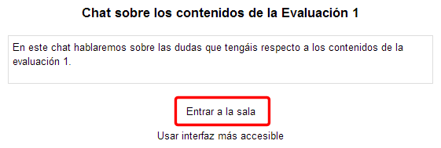
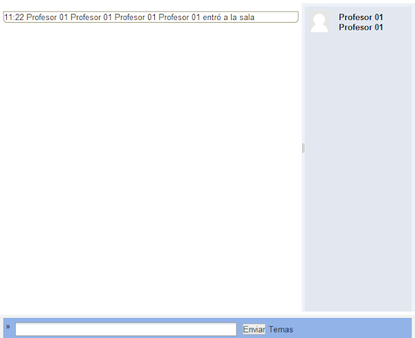

# Participación en un chat

Al acceder a un **chat **se muestra la pantalla:

**Fig. 5.76 Captura de pantalla. Entrada al chat.**

 

Hacemos clic en **Entrar en la sala**.

La segunda de las opciónes (Usar interfaz más accesible) nos puede ser útil si tenemos problemas con el navegador al interpretar Javascript o si tenemos una conexión muy lenta.

Se muestra una pantalla que se divide en dos partes:

- a la **izquierda** con los **mensajes** que aparecen durante una sesión dada del Chat (en este aún no hay ninguno) y
- a la **derecha** se listan **los participantes** actuales de la Sala de Chat.

Por debajo, aparece un **cuadro de texto**, en el que podemos **escribir el mensaje** que deseamos enviar a la página de la sesión del Chat.

**Fig. 5.77 Captura de pantalla. Ventana de chat.**

 

Después de escribir nuestro mensaje, hacemos clic en la tecla **ENTER **y el texto aparecerá en la **lista de mensajes**. Después de unos instantes, será visible para los asistentes de la sala de chat.

**Fig. 5.77 Captura de pantalla. Detalle de conversación.**

 

A continuación tenemos una imagen con la intervención de un alumno/a:

**Fig. 5.78 Captura de pantalla. Detalle de conversación.**

 

Podemos utilizar las siguientes facilidades durante el chat:

- **Emociones: **Puede iniciar un línea con **"/me"** ** **para mostrar una emoción. Por ejemplo, si su nombre es Ana y escribe "/me ríe" todos verán "*** Ana ríe"

- **Beeps: **Puede enviar un pitido a otra persona haciendo clic en el enlace **"beep"** junto al nombre. Podemos utilizarlo para dar un aviso acústico a otra persona del chat y avisarle de nuestra presencia. También puede hacer un beep a todos los participantes del Chat tecleando **"beep all"**.

- **HTML: **Puede utilizar el lenguaje HTML en su texto para insertar imágenes, ejecutar sonidos o formatear texto, entre otras opciones.

 

### Guardar sesiones de chat

Nos muestra los registros de las anteriores sesiones de Chat. Sólo nos muestra las sesiones anteriores determinadas por la opción de **Guardar sesiones pasadas** en la configuración del Chat. Su visualización para el alumnado depende de la opción seleccionada en **Todos **pueden ver las sesiones pasadas.

El listado de las sesiones antiguas nos muestra de cada sesión de chat:

- **Fecha y hora del inicio y final de la sesión**.

- Los **usuarios que participaron** el la sala de Chat seguido con el número de intervenciones entre paréntesis.

<li>Finalmente tenemos dos enlaces para:    
<ul>
- **Ver esta sesión.**
- **Borrar esta sesión.**

## Tarea1

Abre tu moodle en dos navegadores distintos. En uno de ellos entra como profesor/a y en el otro como alumno/a. Haz varias intervenciones en el chat.
