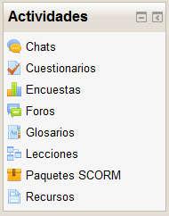
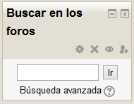
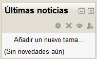
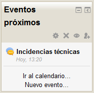
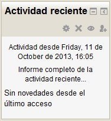
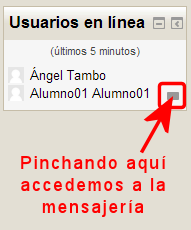
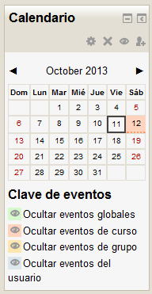
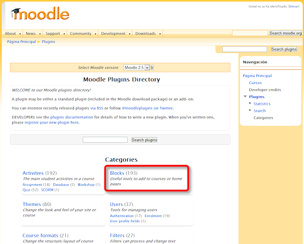

# Tipos de bloques

Los bloques que vienen "por defecto" en Moodle varían con cada versión, pero básicamente nos podemos encontrar con algunos de los siguientes:

### LOS BLOQUES Y SU FUNCIÓN

Nos permite conocer a las personas que están en el mismo curso, independientemente de su perfil.

Este bloque nos permite ver de una forma rápida las actividades y tareas a realizar en el curso. Su aspecto y contenido cambiará en función de las actividades que se hayan definido. En la imagen de la izquierda se muestra se muestran 8 actividades porque son ocho los tipos de actividades que el curso tiene creadas.

Nos permitrá encontrar de forma rápida intervenciones en los foros. Se puede buscar introduciendo un término para nuestra consulta o mediante un formulario para una Búsqueda avanzada . Este bloque no está disponible en este curso.

Aquí se nos mostrarán las novedades y anuncios que vayan apareciendo en el curso. Pulsando en Agregar un nuevo tema podremos realizar anuncios.

Nos permitirá definir la realización o convocatoria de determinadas actividades. Por ejemplo la convocatoria de una sesión de chat, y que se refleje en el calendario. Los eventos pueden ser de Usuario, de Curso o de Sitio (éstos sólo disponibles para el administrador).

Interesante bloque que nos muestra la actividad realizada en el curso por los participantes, en las actividades, por los grupos, y en una fecha o rango de fechas determinados.

Nos muestra las personas que están en un momento determinado conectadas a la vez que nosotros en el curso y, podríamos así, contactar con ellas mediante, por ejemplo, el bloque de mensajería interna.

Sistema de mensajería interna de Moodle. Mediante este bloque podemos mandar mensajes privados a las demás personas participantes en el curso o a nuestros tutores/as.

En él se nos muestra un calendario navegable con indicación, mediante un código de colores, de las fechas en las que hay eventos y de qué tipo son.

Pueden ocultarse cualquiera de los tipos de eventos pulsando en los enlaces bajo el calendario, que a su vez sirve de referencia para los tipos de evento.

## ParaSaberMas

Compara los bloques descritos con los que aparezcan por defecto en tu aula virtual, puede que encuentres alguno más que no se ha mencionado aquí. Esto es así porque los administradores pueden instalar nuevos bloques en función de las necesidades del sitio. Esta es una de las grandes ventajas de Moodle, que viene implicita en su **M** de modular, lo que quiere decir que hay muchas personas, empresas e instituciones que desarrollan nuevas funcionalidades y opciones para Moodle agrupándolas en **módulos** o en **boques**.

Aunque esto excede de los objetivos del este curso de Moodle os remitimos, por si tenéis curiosidad, a la propia página de Moodle en la que podréis revisar la gran disponibilidad de nuevos bloques y módulos. Este es el enlace [Módulos, bloques y plugins, para Moodle](http://moodle.org/plugins/), como podéis ver en la imagen siguiente.

 

**Fig. 2.13 Captura de pantalla de la web de Moodle**

