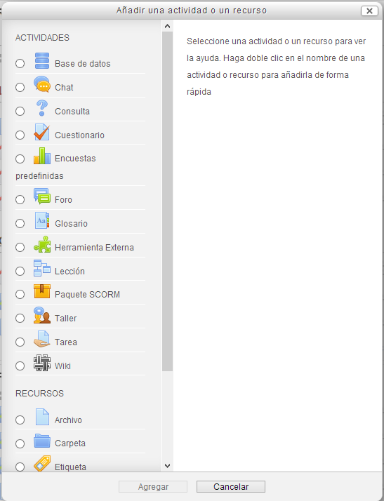

# U1. Actividades interactivas de un curso Moodle

Moodle dispone de un menú muy completo de actividades que podemos incluir en nuestros cursos y que nos permiten realizar un aprendizaje interactivo: tareas, talleres, blog, foros, glosario, lecciones, etc. La primera vez que entres en un nuevo curso solo se mostrará el foro Novedades. Para añadir otro tipo de actividades deberás incluirlas desde el bloque del mismo nombre. Para acceder a este menú, como ya has podido ver, debes ****activar edición**** desde el bloque **Administración**.

**Fig. 5.1 Captura de pantalla. Bloque Administración**

 

Entonces verás que en cada tema aparecen dos menús desplegables que corresponden a Recursos y a Actividades.

**Fig. 5.2 Captura de pantalla. Detalle del enlace de inserción de actividades**

 

Al pulsar sobre este enlace aparece una ventana emergente con la lista de actividades y recursos que podemos incluir en nuestro curso:

**Fig. 5.3 Captura de pantalla. Ventana de inserción de actividades**

 

Este menú te muestra todas las posibilidades disponibles en tu curso. Puedes disponer de más actividades mediante la descarga de módulos no estándar de Moodle.

En este bloque de contenidos veremos cómo añadir Tareas, cuestionarios y glosarios a tu curso.

En los siguientes apartados te explicaremos cómo incluir en tu curso tareas, cuestionarios y glosarios. 

- **Tareas** 

Mediante las tareas, los profesores/as pueden determinar los ejercicios, actividades y trabajos que deberán realizar los alumnos/as y que posteriormente el profesor/a deberá calificar.

- **Cuestionarios **

Se proponen una serie de preguntas a los estudiantes y la calificación se hace de forma automática.

- **Glosario **

Los glosarios permiten incluir definiciones de términos relacionados con los contenidos del curso. Hay dos tipos de glosario: glosario de curso y glosario secundario en los que tanto profesores/as como alumnos/as, pueden incluir definiciones de términos claves para el curso, respectivamente.
