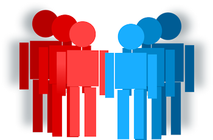

# U2. Roles

|**Fig. 4.7 Obtenida de [Pixabay](http://pixabay.com/en/queue-communal-community-group-154925/). Licencia CC0**

Los roles permiten definir los distintos niveles de interacción (y control) y acceso que un usuario puede establecer en un contexto Moodle determinado (curso, actividad,...). Los roles llevan asociados permisos y habilidades que se pueden aplicar a diferentes usuarios y contextos. Las capacidades y permisos asociados a un rol determinado se pueden modificar desde un nivel de administrador. La capacidad de configuración de los roles en el nivel de profesor/a está más limitada.

Los roles más comunes en Moodle son los que aparecen en la imagen anterior, siendo el ****1 Guest**** el que menos privilegios tiene y el ****6 Administrador**** el que mayor dominio tiene del curso.

Aunque como profesores sólo podemos asignar algunos de ellos, como luego veremos, vamos a explicar muy rápidamente las características de cada uno de ellos.
<td align="center" style="width: 5%;"> </td><td align="center" style="width: 20%;">**ROL **</td><td align="center" style="width: 70%;">**DESCRIPCIÓN **</td>
<td align="center">**1 **</td><td align="right" style="width: 20%;">** INVITADO (Guest)  **</td><td align="justify">Apenas tiene privilegios. Puede acceder a los cursos (si los configuramos para que puedan hacerlo) y ver los contenidos y las actividades. Pero no están matriculados y, por tanto, no pueden acceder a cuestionarios, calificador, correo, foros,...</td>
<td align="center">**2 **</td><td align="right">** ESTUDIANTE**</td><td align="justify">Los estudiantes pueden manejar todo lo que se les ofrece en un curso (para eso están), comunicarse con su profesor, participar en foros y chat, consultar recursos, hacer actividades,... pero no pueden modificar nada del curso.</td>
<td align="center">**3 **</td><td align="right">** PROFESOR-NO EDITOR **</td><td align="justify">(En nuestra imagen tutor) Pueden enseñar, calificar a los estudiantes, emitir informes, titularlos, comunicarse con los estudiantes por todos los medios, pero no pueden editar ni modificar el curso.</td>
<td align="center">**4 **</td><td align="right">** PROFESOR**</td><td align="justify">Puede hacer lo mismo que el tutor, pero además puede editar un curso, aunque no crearlo. Puede asignar algunos roles, mostrar u ocultar tareas o contenidos, etc.</td>
<td align="center">**5 **</td><td align="right">** AUTOR**</td>|Puede también crear un curso.
<td align="center">**6 **</td><td align="right">** ADMINISTRADOR**</td><td align="justify">Puede hacer de todo. Puede eliminar o crear un curso, administrar roles y asignar permisos y privilegios, editar, modificar, establecer escalas de calificación,... Hay dos niveles de Administrador: a nivel de curso (tiene todos los privilegios sobre un curso) o a nivel de Plataforma. Pero este es un tema para un nivel de formación posterior.</td>

 

 
