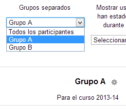

# U5. Configuración grupos

Como ya hemos visto anteriormente, en el **panel de participantes**, podemos organizar a los participantes de nuestro curso en varios grupos. Esta función es muy útil tanto para matricular a distintos grupos del mismo nivel en un mismo curso (Geografía e Historia. 1º ESO. Grupos A, B y C), asignándole a cada uno un profesor/a distinto, como para organizar grupos dentro de un mismo curso para realizar determinadas actividades. 

Dependiendo de como configuremos los grupos, se establecerán distintos grados de visbilidad en el curso: por ejemplo, que cada profesor/a pueda ver sólo lo que hace su grupo, permitiendo que el grupo sepa perfectamente quien es su profesor y que el estudiante vea sólo lo que hacen sus compañeros/as (y no los de otros grupos) si esto es lo que nos interesa.

**Fig. 4.25 Captura de pantalla. Desplegable de grupos**

 

Moodle nos ofrece **dos modos** para crear los grupos (manual y automático), tres maneras de organizar un curso en cuanto a los grupos: **No hay grupos, Grupos separados y grupos visibles** y dos opciones para su configuración, **general y por tareas**. Vamos a ver primero como crear los grupos y luego como configurar nuestro curso en este sentido.
